More examples
=============

All examples are located in the ``examples/`` directory of the Guitares repository.
To run an example:

.. code-block:: bash

   cd examples/<example_name>
   python <example_name>.py

.. contents::
   :local:
   :depth: 1

----

Hello World
-----------

The simplest possible Guitares application: an edit box that greets the user by name.
See :doc:`simple_example` for a full walkthrough.

**Location:** ``examples/hello/``

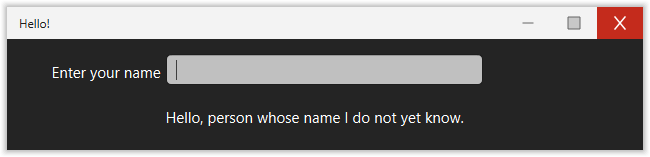

.. code-block:: bash

   cd examples/hello && python hello.py

----

Simple Calculator
-----------------

Demonstrates **pop-up menus**, **edit boxes**, and a simple callback that reads multiple
variables and writes a result.

**Location:** ``examples/calculator/``

The calculator window contains two numeric input fields, a dropdown for the operator
(+, −, ×, ÷), and a disabled edit box that shows the result.

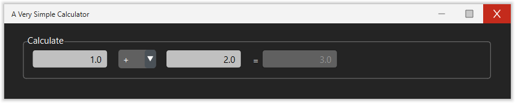

.. literalinclude:: ../../examples/calculator/calculator.yml
   :language: yaml

----

Checkbox
--------

A minimal example showing **checkbox** usage and how a boolean variable controls a text label.

**Location:** ``examples/checkbox/``

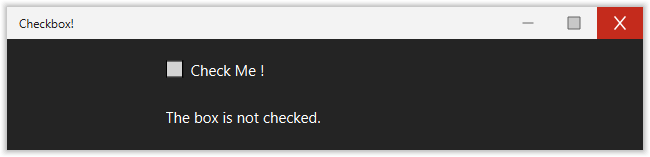

----

Listboxes
---------

Demonstrates all four combinations of listbox configuration:

* Single selection by item
* Multi-selection by item
* Single selection by index
* Multi-selection by index

**Location:** ``examples/listboxes/``

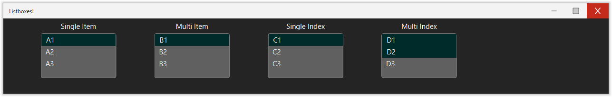

.. literalinclude:: ../../examples/listboxes/listboxes.yml
   :language: yaml

----

Pop-up menus
------------

Demonstrates all dropdown configurations: item vs index selection, static vs dynamic option lists.

**Location:** ``examples/popupmenus/``

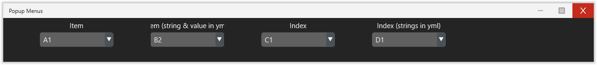

----

Radio buttons
-------------

Demonstrates the **radio button group** widget.

**Location:** ``examples/radiobutton/``

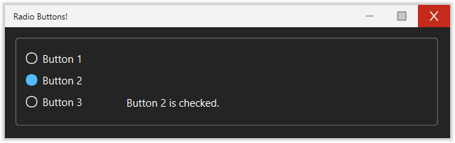

----

Table view
----------

Demonstrates the **tableview** widget with a ``pandas.DataFrame``.
Shows how to populate the table from a variable and react to row selection.

**Location:** ``examples/table/``

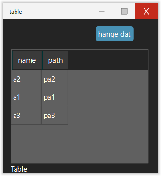

----

Menu
----

Demonstrates how to add a **drop-down menu bar** with nested menus.

**Location:** ``examples/menu_example/``

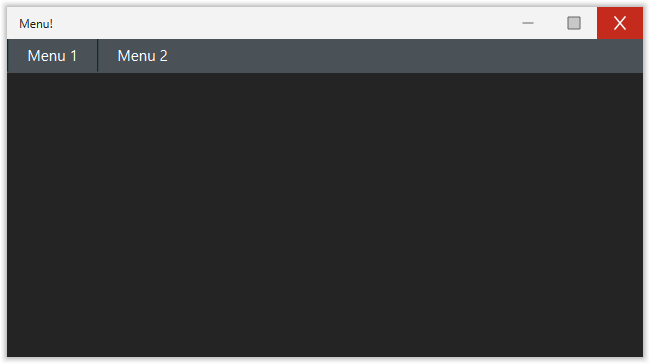

----

Popup window
------------

Demonstrates both styles of **modal popup dialog**:

* A simple popup with an OK/Cancel button pair
* A data-driven popup that reads initial values and returns updated ones

**Location:** ``examples/popup_window/``

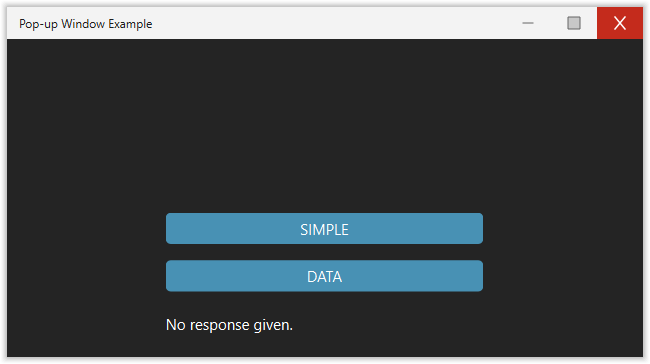

----

Frame collapse
--------------

Demonstrates a **collapsible split frame** — two panels side by side where one panel can
be collapsed to give more space to the other.
The example shows a map on the left and a web view on the right.

**Location:** ``examples/frame_collapse/``

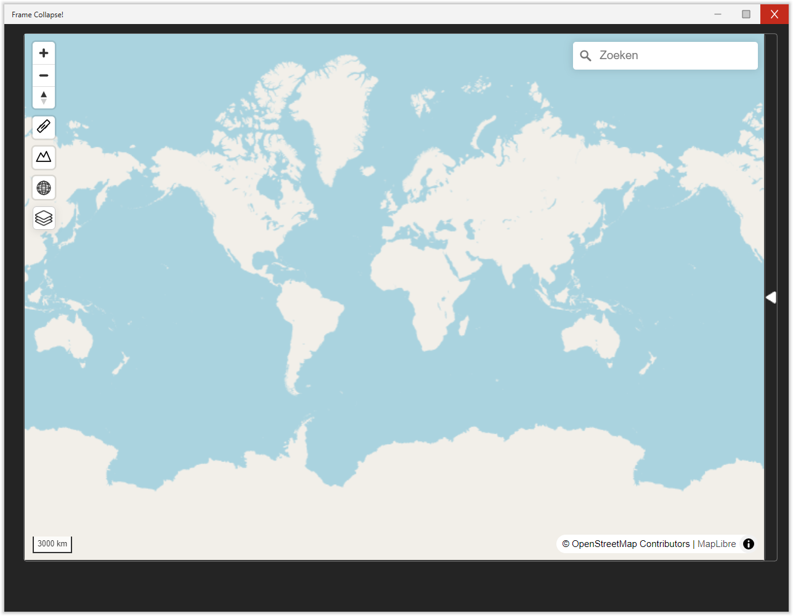

----

News Website Comparison
-----------------------

Two **web view** elements side by side, each loading a different news website.
A minimal example with no callbacks or variables — just YAML config.

**Location:** ``examples/webpage/``

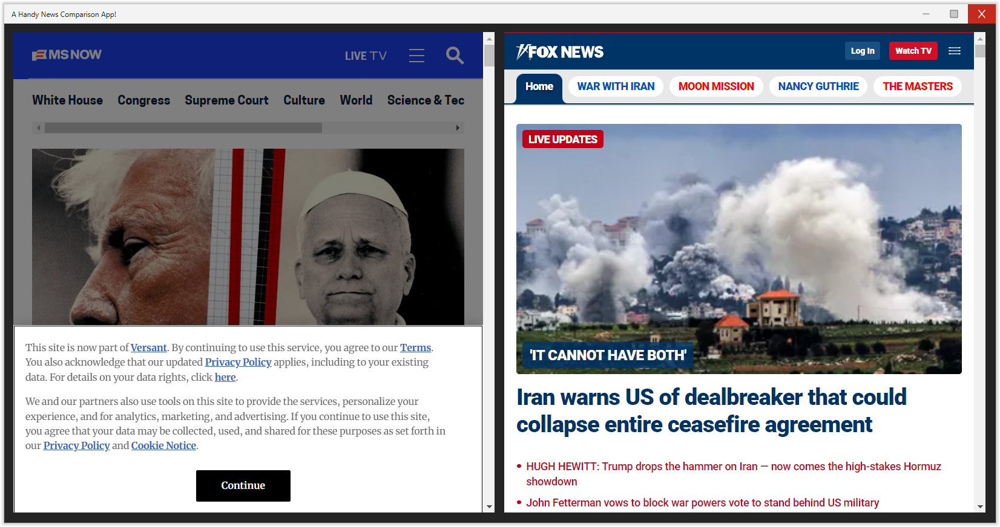

.. literalinclude:: ../../examples/webpage/webpage.yml
   :language: yaml

----

MapLibre map
------------

Demonstrates the **MapLibre GL** map widget with a list box to change the basemap style.

**Location:** ``examples/maplibre/``

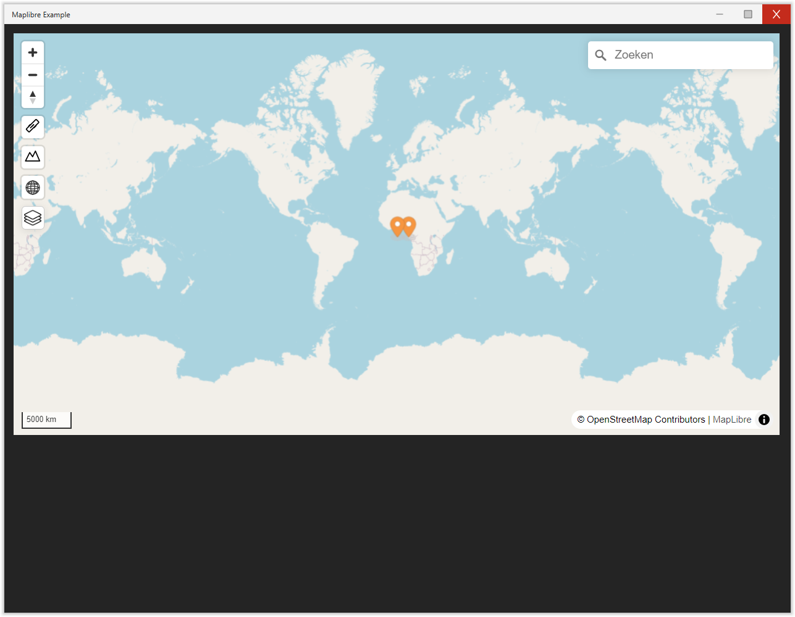

.. code-block:: bash

   cd examples/maplibre && python maplibre_example.py

----

Visual Delta
------------

A more complex example demonstrating a **map widget** with **menus**, **dropdowns**,
**sliders**, and **buttons** for exploring climate impact scenarios.

**Location:** ``examples/visualdelta/``

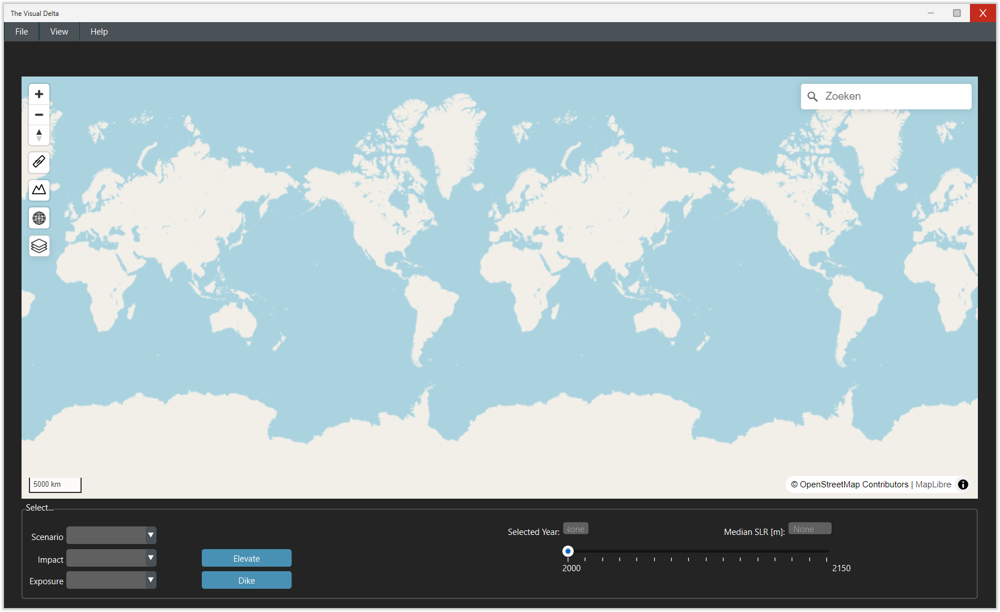
