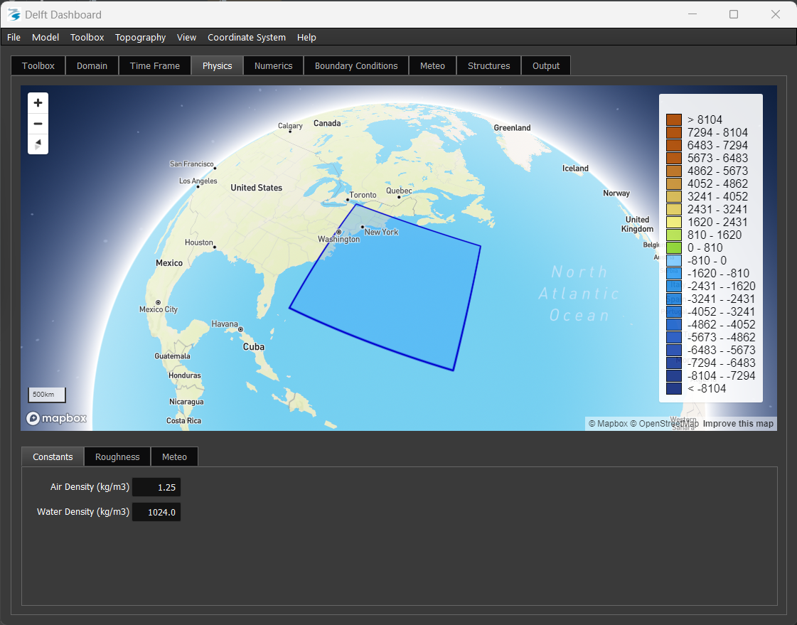

Welcome to the Guitares documentation!
======================================

Guitares is a Python package for building configurable Graphical User Interfaces (GUIs) using the PyQt5 framework. GUI configurations can be defined programmatically, but are typically provided by the developer in YAML configuration files.

A Guitares GUI consists of a main window (with optional drop-down menu) that contains one or more UI elements. Guitares currently supports the following UI elements (or widgets):

* Tab panels
* Frames
* Edit boxes
* Text
* Pop-up menus
* List boxes
* Sliders
* Push buttons
* Web views
* MapBox maps

Please see the Elements section for more information about each UI element.

Check out the :doc:`usage` section for instructions on how to get started!

.. note::

   This project is under active development.

Contents
--------

.. toctree::

   getting_started
   simple_example
   elements
   menu
   positioning
   callbacks
   guiobject
   configuration
   mapbox
   stylesheets
   examples
