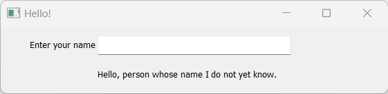
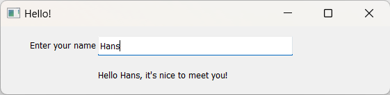

A Very Simple Example
=====================

The Python code for a simple Guitares application consists of four components:

* A YAML **configuration file** that contains information about the main window, as well as the various UI elements in the GUI
* An **app module** (often called *app.py*) that contains an instance (usually called *app*) of the class (usually called *Application*) that holds all of the GUI configuration data, and builds up the GUI
* A **callback module** that contains the different functions (or methods) that are called when the user interacts with the GUI
* A **run module** to start the application

Let's have a look at a very simple GUI in which the user is asked to enter her or his name, and is then greeted by the program. We shall call this program *hello*.

The **configuration file** (*hello.yml*)
---------------------------------

.. code-block:: dos

   window:
     title: Hello!
     width: 300
     height: 70
     module: callbacks
     variable_group: hello
   element:
     - style: edit
       position:
         x: 100
         y: 40
         width: 100
         height: 20
       variable: name
       method: enter_name
     - style: text
       position:
         x: 100
         y: 10
         width: 100
         height: 20
       variable: response

In the configuration file, we define properties for the main window, and for the various UI elements that will make up our GUI.

We not only set the size and title of the window, but also define the name of callback module (in this case *callbacks*), and a name (*hello*) of the group where GUI variables will be stored (more about this in the next section).

In this example, we use UI elements of two different styles: an *edit* element to enter the name and a *text* element to show the response. The *edit* element requires a *position*, a *variable* name, and a callback *method* that is executed when the user enters a name. The non-interactive *text* element in our case only requires a *position* and *variable*. 
   
The **app module** (*app.py*)
---------------------------------

.. code-block:: python

   from guitares.gui import GUI

   class Application:
       def __init__(self):

           # Initialize GUI 
           self.gui = GUI(self,
                          config_file="hello.yml")

           # Define GUI variables
           self.gui.setvar("hello", "name", "")
           self.gui.setvar("hello", "response", "Hello, person whose name I do not yet know.")

   app = Application()
   
In the **app module**, the *GUI* class is imported from the Guitares package. When the *app* instance of the *Application* class is created, the GUI is initialized, using the configuration file *hello.yml*. Next, the GUI variables are defined using the *setvar* method of the *GUI* class. These variables are stored in a ``dict`` that is an attribute of the *gui* object. GUI variables are always stored in variable groups (in our case the name of the group is "hello"). They contain the values entered or selected in the various UI elements (e.g. the string that is entered by the user in an edit box). In this simple example, we defined two variables: one for the *name to be entered and one for the *response* by the program.

The **callback module** (*callbacks.py*)
---------------------------------

.. code-block:: python

   from app import app

   def enter_name(*args):
       name = app.gui.getvar("hello", "name")
       response = "Hello " + name + ", it's nice to meet you!"
       app.gui.setvar("hello", "response", response)

When the user enters a name, the application executes the callback method *enter_name* in the **callback module**. The program gets the variable *name* using the *getvar* method, and defines the response. Next, the GUI variable *response* is updated using the *setvar* method. After each execution of a callback method, the elements in the GUI are updated. This means that the response automatically appears in the user interface.

The **run module** (*hello.py*)
---------------------------------

.. code-block:: python

   # Import the application object
   from app import app

   if __name__ == '__main__':
       # Build the GUI
       app.gui.build()
   
The **run module** does not require editing. It imports the *app* object, and then builds the GUI. Only the name of the this module (in our case *hello.py*) should be changed by the developer. To start the application, the user simply calls:

.. code-block:: dos

   python -m hello

The following window now shows up, prompting the user to enter a name.

After entering the name, the GUI is automatically updated with a new response.

