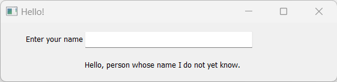
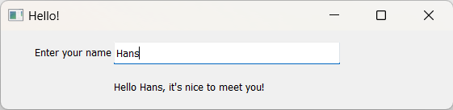

A Very Simple Example
=====================

The Python code for a simple Guitares application consists of four components:

* A YAML **configuration file** that describes the main window and its UI elements
* An **app module** (``app.py``) that creates an ``Application`` instance, initializes variables, and sets up the GUI
* A **callback module** (``callbacks.py``) that contains functions called when the user interacts with the GUI
* A **run module** (``hello.py``) that starts the application

Let's look at a simple GUI that asks the user for their name and greets them. We call this program *hello*.

The configuration file (``hello.yml``)
---------------------------------------

.. literalinclude:: ../../examples/hello/hello.yml
   :language: yaml

The config file defines the main window size and title, the default callback module (``callbacks``),
and the default variable group (``hello``).

Two elements are defined:

* An **edit** box where the user types their name, linked to the variable ``name`` and the callback ``enter_name``
* A **text** label that displays the variable ``response``

The app module (``app.py``)
-----------------------------

.. literalinclude:: ../../examples/hello/app.py
   :language: python

The ``Application`` class creates a ``GUI`` object using the config file and sets up the two
variables (``name`` and ``response``) before the window is built.
The ``app`` instance is module-level so that callback modules can import it.

The callback module (``callbacks.py``)
----------------------------------------

.. literalinclude:: ../../examples/hello/callbacks.py
   :language: python

When the user types a name and presses Enter, ``enter_name`` is called.
It reads the ``name`` variable, builds a greeting string, and writes it to ``response``.
After the callback returns, Guitares automatically refreshes the GUI — the greeting appears
in the text label without any extra code.

The run module (``hello.py``)
-------------------------------

.. literalinclude:: ../../examples/hello/hello.py
   :language: python

The run module imports ``app`` and calls ``app.gui.build()``, which creates the window and
starts the Qt event loop. Run the application with:

.. code-block:: bash

   python hello.py

The following window appears, prompting for a name:

After entering a name, the GUI automatically updates with the greeting:

